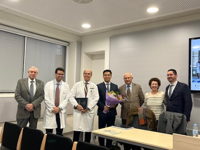

#### News

- 27/09/2023 - [EUROPEAN DEVELOPMENTAL BIOLOGY CONGRESS 2023](https://registrations.hg3conferences.co.uk/hg3/frontend/reg/thome.csp?pageID=89188&ef_sel_menu=1846&eventID=236)  - Melissa Acosta presented a Poster. Our visiting Scholar from [ICEP](https://www.internationalcollaborationexchange.org) program, Philipp Menauer also attended to the congress.

- 15/09/2023 - We welcome [Antonio Altuna Coy](https://alfonsnavarro.github.io/lab/pages/people.html), our new posdoctoral researcher in the lab!!!  - Antonio will be working on Extracellular vesicles in Lung cancer. -

- 05/05/2023 - Our group has reached an agreement with the Chinese company Dimosi Lifescience & Medical that enables research into proteins that will help in the prognosis and therapy of lung cancer.[See the complete new here.](http://www.fbg.ub.edu/en/news/an-agreement-between-the-ub-and-dimosi-lifescience-medical-enables-research-into-proteins-that-will-help-in-the-prognosis-and-therapy-of-lung-cancer/):

- 01/04/2023 - We were asked to design the cover image of Biocell journal after acceptance of our [Viewpoint](https://www.techscience.com/biocell/v47n5/52280) about tumor-draining vein and extracellular vesicles in lung cancer:

Please see our Viewpoint [here](https://www.techscience.com/biocell/v47n5/52280)

- 03/02/2023 - We are participating in the *IDIBAPS Scientific Photo Contest, edition 2023* with this picture:

Please vote our Picture [here](https://photos.google.com/share/AF1QipPfFjb-HJX0ecIZARWrnAOSehKI4lGiClxSQuOCmxi40G9eKDLu-8ajyHQbZ9_Mrg?pli=1&key=cTJpa1hfbDc5VWJxeUtqYW1ZYXczVnJzLUtCS1R3)

- 02/23/2023 - [Thesis defense of Bing Han](https://www.ub.edu/portal/web/dp-cirurgiaespecialitats/detall-novetats/-/detall/defensa-de-tesis-del-dr-bing-han)

	The people in the photo are: (from right to left) Tribunal: Dr. Marc Campayo, Dr. Isabel Moreno and Dr. Albert Biete. Dr. Bing Han and the directors of the thesis: Dr. Laureano Molins and Dr. Alfons Navarro. Finally, Dr. Mariano Monzó as emeritus professor of the Department.

- 02/10/2023 - [XXXIV DEVELOPMENTAL BIOLOGY MEETING](https://scb.iec.cat/xxxiv-jornada-de-biologia-del-desenvolupament/)  - Melissa Acosta presented a Poster

