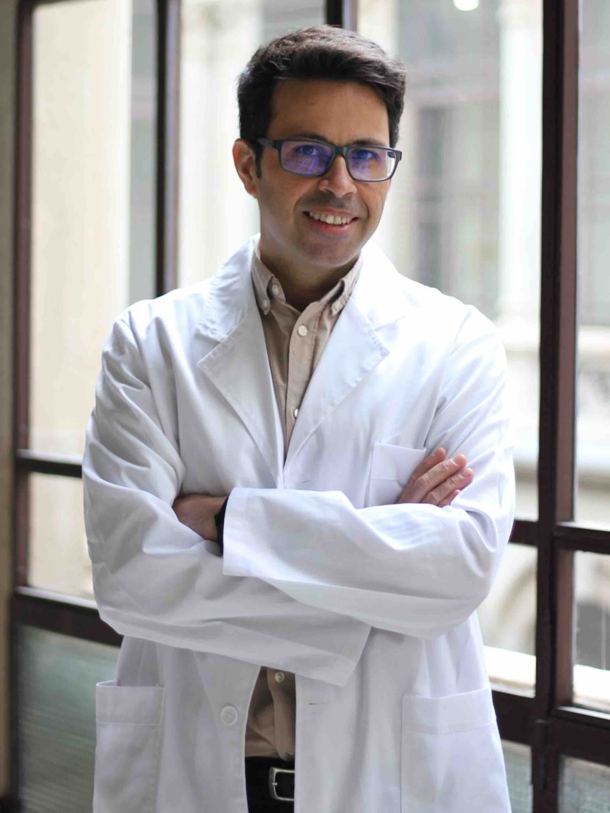
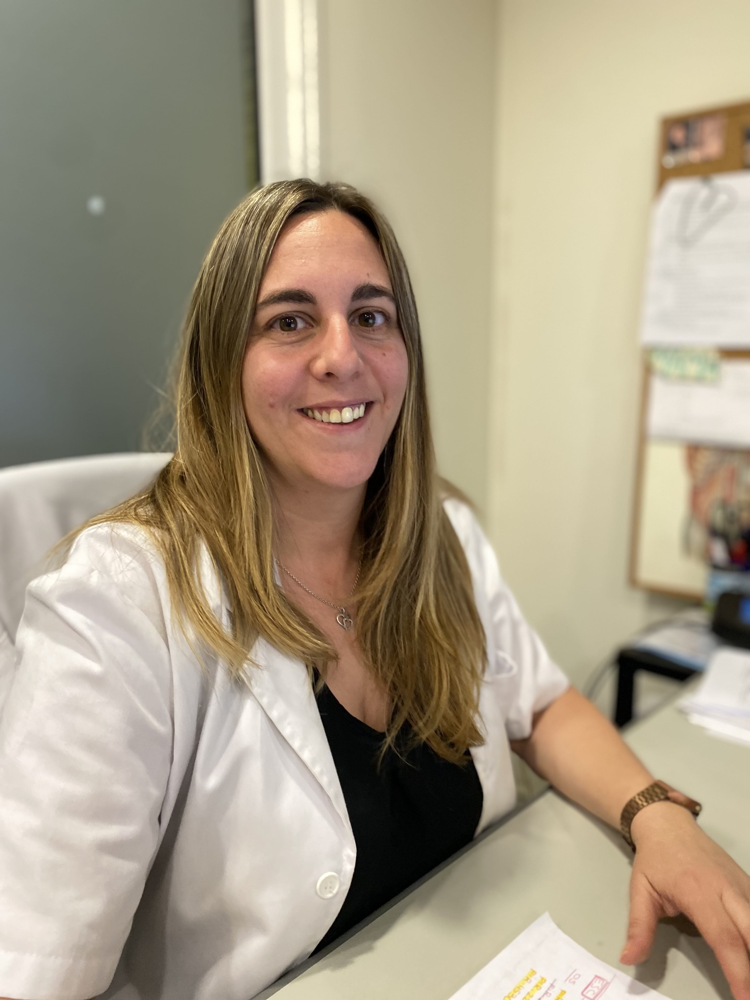
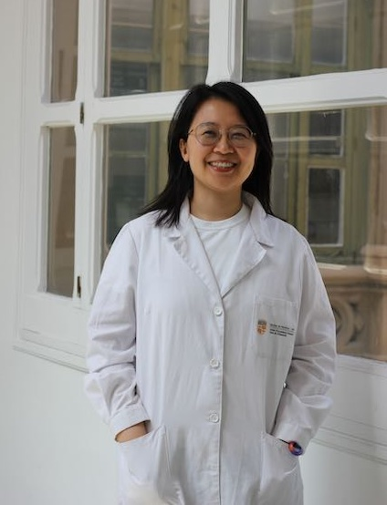
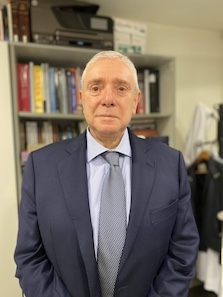

<head>
<meta name="viewport" content="width=device-width, initial-scale=1">

</head>
<body>

<h2>Current Lab Members</h2>
 

  

    

      
      

        <h3>Alfons Navarro, PhD</h3>
        
Associate Professor - Principal Investigator

        
Human Anatomy and Embriology Unit

        
ORCID: <a href="https://orcid.org/0000-0001-6071-0926">0000-0001-6071-0926</a>

        
Google Scholar: <a href="https://scholar.google.es/citations?user=xF42u88AAAAJ&hl=es">xF42u88AAAAJ</a>

        

    

  

 
  

    

      
      

        <h3>Melissa Acosta, MSc</h3>
        
FI-SDUR Fellow

        
Human Anatomy and Embriology Unit

        
ORCID:<a href="https://orcid.org/0000-0001-6679-8869">0000-0001-6679-8869</a>

        
Google Scholar: <a href="">-</a>

        

    

  

  
  

    

      
      

        <h3>Antonio Altuna Coy, PhD</h3>
        
Posdoctoral researcher

        
Human Anatomy and Embriology Unit

        
ORCID:<a href="https://orcid.org/0000-0001-6544-3759">0000-0001-6544-3759</a>

        
Google Scholar: <a href="">-</a>

        

        

    

  

  

    

      
      

        <h3>Tania Diaz, PhD</h3>
        
Lecturer

        
Human Anatomy and Embriology Unit

        
ORCID: <a href="https://orcid.org/0000-0001-9576-8351">0000-0001-9576-8351</a>

        
Google Scholar: <a href="">-</a>

        

        

    

  

  

    

      
      

        <h3>Yangyi He, MD</h3>
        
PhD Student

        
Human Anatomy and Embriology Unit

        
ORCID: <a href="https://orcid.org/0000-0003-0792-193X">0000-0003-0792-193X</a>

        
Google Scholar: <a href="">-</a>

        

        

    

  

  

    

      
      

        <h3>Risha Na, MD</h3>
        
PhD Student

        
Human Anatomy and Embriology Unit

        
ORCID: .

        
Google Scholar: <a href="">-</a>

        

        

    

  

<h2 id="clinical-collaborators">Clinical col·laborators</h2>
<h4>
<ul>
  <li><a href="https://www.clinicbarcelona.org/profesionales/ramon-marrades">Ramón M. Marrades</a> (Pulmonologist, Hospital Clínic)</li>
  <li><a href="https://www.barnaclinic.com/es/cuadro-medico/188/laureano">Laureano Molins</a> (Thoracic Surgeon, Hospital Clínic)</li>
  <li><a href="https://www.clinicbarcelona.org/profesionales/nuria-vinolas">Nuria Viñolas</a> (Oncologist, Hospital Clínic)</li>
  <li><a href="https://www.linkedin.com/in/david-sanchez-lorente-md-phd-10981834/?trk=public_profile_browsemap&amp;originalSubdomain=es">David Sánchez Lorente</a> (Thoracic Surgeon, Hospital Clínic)</li>
  <li><a href="https://www.linkedin.com/in/jorge-moisés-lafuente-2563a315/?originalSubdomain=es">Jorge Moisés Lafuente</a> (Pulmonologist, Hospital Clínic)</li>
  <li><a href="http://cdb.hospitalclinic.org/facultativos/54/jose-ramirez-ruz">José Ramírez Ruz</a> (Pathology, Hospital Clínic)</li>
  <li><a href="https://www.linkedin.com/in/daniel-martinez-hernandez-b7b22653/?originalSubdomain=es">Daniel Martínez</a> (Pathology, Hospital Clínic)</li>
</ul>
</h4>

<h2 id="Students">Undergraduate and Master students</h2>
<h4>
<ul>
  <li>
    <a href="https://de.linkedin.com/in/eylül-korkmaz-508606198?trk=people-guest_people_search-card">Eylül Korkmaz</a>.
    Erasmus Student, Master of Molecular Biotechnology, Faculty of Pharmacy, UB, 2023-2024
      
    
       
  </li>
  <li> 
    <a href="">Tianmiao Yang</a>.
    Master of Translational Medicine, UB, 2023-2024
      
    
       
  </li>
  <li>
    <a href="https://de.linkedin.com/in/philipp-menauer-3bb55b299?trk=people-guest_people_search-card">Philipp Menauer</a>.
    ICE program, visiting scholar from LMU, Munich Germany. 2023
       
    
       
  </li>
  <li>
    <a href="https://fr.linkedin.com/in/lea-vilanova-mana?trk=people-guest_people_search-card">Lea Vilanova Mañà</a>.
    Master of Bioinformatics and Biostatistics, UOC, Internship student. 2021
       
  </li>
  <li>
    <a href="https://es.linkedin.com/in/jara-martín-serrano-0a099a159?trk=people-guest_people_search-card">Jara Martín</a>.
    Master of Biomedicine, UB, 2019-20
       
  </li> 
</ul>
</h4>

<h2 id="Past_Members">Past members</h2>
<h4>
<ul>
  <li>
    <a href="">Mariano Monzó Planella</a>
       
    Emeritus Professor, past lab director (2002-2020)
     
    
  </li>
</ul>
</h4>

<h2 id="phd-alumni">Past PhD Alumni</h2>
<h4>
<ul>
  <li><a href="https://es.linkedin.com/in/jose-carlos-benítez-montañez-a5b82213b">José Carlos Benítez Montañez</a>. <a href="http://hdl.handle.net/10803/691573">Thesis: </a><em>ARNs no codificantes como biomarcadores predictivos y pronósticos de la quimio-radioterapia neoadyuvante en cáncer de recto</em>(2024)</li>
    <li><a href="https://www.linkedin.com/in/bing-han-107121188/?originalSubdomain=es">Bing Han</a>. Thesis: <em>Characterization of the non-coding RNA cargo in extracellular vesicles from surgical non-small cell lung cancer patients identifies lncRNA HOTTIP and miR-203a-3p as relapse biomarkers</em> (2023)</li>
  <li><a href="https://www.linkedin.com/in/canalsserrat/">Jordi Canals Serrat</a>.Thesis: <em>El mesénquima embrionari pulmonar i la seva relació en el control del cáncer de pulmó</em> (2022)</li>
  <li><a>Yan Li</a>. Thesis: <em>Analysis of the K-RAS mutant alleles and lincRNA-p21 expression in tumors and liquid biopsy as prognostic factors in surgical colorectal cancer patients</em> (2020)</li>
  <li><a href="https://www.linkedin.com/in/jorge-moisés-lafuente-2563a315/">Jorge Moisés Lafuente</a>. Thesis: <em>Estudio de los elementos reguladores de la embriogenesis NKX2-1, NANCI y HOTTIP en
estadios precoces de cáncer de pulmón de célula no pequeña</em> (2020)</li>
  <li><a href="https://www.linkedin.com/in/joan-josep-castellano-pérez-92760588/">Joan Josep Castellano Pérez</a>. Thesis: <em>Impacto pronóstico del lincRNA-p21 en tejido tumoral y exosomas de cáncer de pulmón
de célula no pequeña</em> (2019)</li>
  <li><a href="https://www.linkedin.com/in/sandra-santasusagna-8b447083/">Sandra Santasusagna Canal</a>. <em>Exosomas y microRNAs en biopsia líquida como biomarcadors pronóstico del cáncer de
colon</em> (2018)</li>
  <li><a href="https://www.linkedin.com/in/marcruizmartinez/">Marc Ruíz Martínez</a>. Thesis: <em>Estudio del gen YKT6 y miRNAs asociados en la liberación de exosomas en pacientes quirúrgicos de cáncer de pulmón</em> (2016)</li>
  <li><a href="https://www.linkedin.com/in/anna-cordeiro-santanach-phd-9b540580/">Anna Cordeiro Santanach</a>. Thesis: <em>ARNs no codificantes pequeños en Linfoma de Hodgkin: regulación epigenética de microRNAs e importancia de la vía PIWI/Pirna</em> (2016)</li>
  <li><a href="https://www.linkedin.com/search/results/all/?keywords=rut%20tejero&origin=GLOBAL_SEARCH_HEADER&sid=ewE">Rut Tejero Villalba</a>. Thesis: <em>Utilidad de la familia miR-200 como marcador pronóstico en dos tumores de origen endodérmico: Cáncer de Pulmón y Cáncer Colorrectal</em> (2014)</li>
  <li><a href="https://www.clinicbarcelona.org/profesionales/marina-diaz">Marina Díaz Beyá</a>. Thesis: <em>Estudio del patrón de expresión de microRNAs en subtipos de leucemia aguda mieloblástica (LAM) poco frecuentes y análisis del valor pronóstico de microRNAs en LAM de riesgo citogenético intermedio</em> (2014)</li>
  <li><a href="https://www.linkedin.com/in/marc-campayo-a303b65b/">Marc Campayo Guillaumes</a>. Thesis: <em>Anàlisi de polimorfismes d’una sola base (SNPs) com a factors predictius de recaiguda en pacients amb càncer de pulmó de cèl·lula no petita quirúrgic</em> (2011)</li>
  <li><a href="https://www.linkedin.com/in/tania-diaz-sanchez-62b684a3/">Tania Díaz Sánchez</a>. <em>JAK2 en el linfoma de Hodgkin: Impacto pronóstico de la regulación mediada por miR-135a y análisis in vitro de Lestaurt</em> (2011)</li>
  <li><a href="https://www.linkedin.com/in/elena-gallardo-65596157/">Elena Gallardo Martín</a>. Thesis: <em>Importancia clínica de los micrornas de la vía de p53 en cáncer de pulmón no microcítico: miR-34a y miR-16</em> (2011)</li>
  <li><a href="https://www.linkedin.com/in/aina-pons-phd-6b967433/">Aina Pons Rosell</a>. Thesis: <em>Análisis de los perfiles de expresión de microRNAs en enfermedades hematológicas: Síndromes mielodisplásicos y Linfoma de Hodgkin</em> (2010)</li>
</ul>

</h4>

