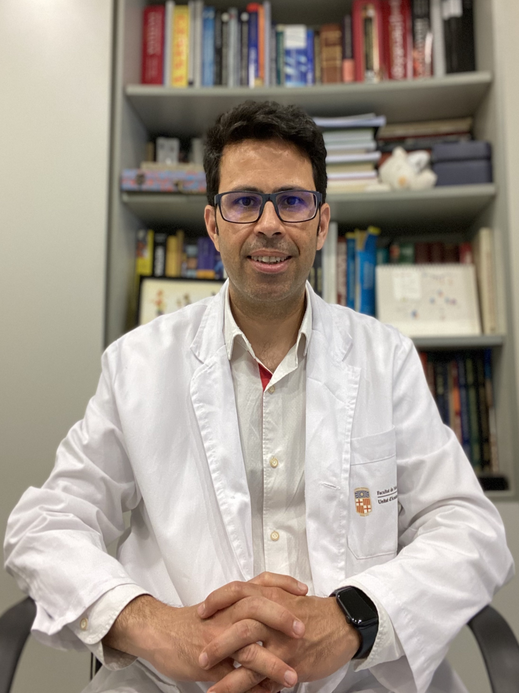
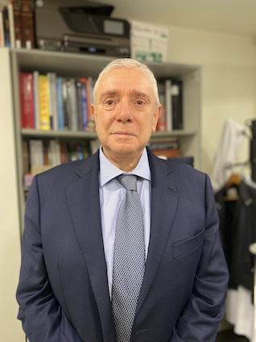
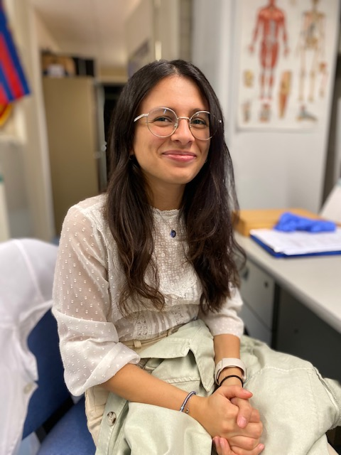
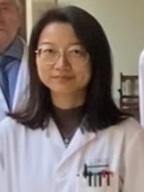

<head>
<meta name="viewport" content="width=device-width, initial-scale=1">

</head>
<body>

<h2>Current Lab Members</h2>
 

  

    

      
      

        <h2>Alfons Navarro</h2>
        
Associate Professor - Principal Investigator

        
Human Anatomy and Embriology Unit

        
ORCID: 0000-0001-6071-0926

        
Scopus Author ID: 34571783600

        
Researcher ID: C-2453-2015

        

    

  

 

    

      
      

        <h2>Mariano Monzo</h2>
        
Emeritus Professor

        
Human Anatomy and Embriology Unit

        
ORCID: 0000-0003-2322-4851

        
Scopus Author ID: XXXXXXXX

        
Researcher ID: XXXXXXXX

        

    

  

  
  

    

      
      

        <h2>Melissa Acosta</h2>
        
FI-SDUR Fellow

        
Human Anatomy and Embriology Unit

        
ORCID: 0000-0001-6679-8869

        
Scopus Author ID: XXXXXXXX

        
Researcher ID: XXXXXXXX

        

    

  

  
  

    

      
      

        <h2>Sandra Castagno</h2>
        
Emili Letang Fellow

        
Human Anatomy and Embriology Unit

        
ORCID: 0000-XXXXX-XXXXXXX

        
Scopus Author ID: XXXXXXXX

        
Researcher ID: XXXXXXXX

        

        

    

  

  

    

      
      

        <h2>Tania Diaz</h2>
        
Lecturer

        
Human Anatomy and Embriology Unit

        
ORCID: 0000-XXXXX-XXXXXXX

        
Scopus Author ID: XXXXXXXX

        
Researcher ID: XXXXXXXX

        

        

    

  

  

    

      
      

        <h2>Yangyi He</h2>
        
PhD Student

        
Human Anatomy and Embriology Unit

        
ORCID: 0000-XXXXX-XXXXXXX

        
Scopus Author ID: XXXXXXXX

        
Researcher ID: XXXXXXXX

        

        

    

  

<h4 id="clinical-collaborators">Clinical col·laborators</h4>

<ul>
  <li><a href="https://www.clinicbarcelona.org/profesionales/ramon-marrades">Ramón M. Marrades</a> (Pulmonologist, Hospital Clínic)</li>
  <li><a href="https://www.barnaclinic.com/es/cuadro-medico/188/laureano">Laureano Molins</a> (Thoracic Surgeon, Hospital Clínic)</li>
  <li><a href="https://www.clinicbarcelona.org/profesionales/nuria-vinolas">Nuria Viñolas</a> (Oncologist, Hospital Clínic)</li>
  <li><a href="https://www.linkedin.com/in/david-sanchez-lorente-md-phd-10981834/?trk=public_profile_browsemap&amp;originalSubdomain=es">David Sánchez Lorente</a> (Thoracic Surgeon, Hospital Clínic)</li>
  <li><a href="https://www.linkedin.com/in/jorge-moisés-lafuente-2563a315/?originalSubdomain=es">Jorge Moisés Lafuente</a> (Pulmonologist, Hospital Clínic)</li>
  <li><a href="http://cdb.hospitalclinic.org/facultativos/54/jose-ramirez-ruz">José Ramírez Ruz</a> (Pathology, Hospital Clínic)</li>
  <li><a href="https://www.linkedin.com/in/daniel-martinez-hernandez-b7b22653/?originalSubdomain=es">Daniel Martínez</a> (Pathology, Hospital Clínic)</li>
</ul>

<h4 id="phd-alumni">PhD Alumni</h4>

<ul>
  <li>Bing Han. Thesis: <em>Characterization of the non-coding RNA cargo in extracellular vesicles from surgical non-small cell lung cancer patients identifies lncRNA HOTTIP and miR-203a-3p as relapse biomarkers</em> (2023)</li>
  <li>Jordi Canals Serrat.Thesis: <em>El mesénquima embrionari pulmonar i la seva relació en el control del cáncer de pulmó</em> (2022)</li>
  <li>Yan Li. Thesis: <em>Analysis of the K-RAS mutant alleles and lincRNA-p21 expression in tumors and liquid biopsy as prognostic factors in surgical colorectal cancer patients</em> (2020)</li>
  <li>Jorge Moisés Lafuente. Thesis: <em>Estudio de los elementos reguladores de la embriogenesis NKX2-1, NANCI y HOTTIP en
estadios precoces de cáncer de pulmón de célula no pequeña</em> (2020)</li>
  <li>Joan Josep Castellano Pérez. Thesis: <em>Impacto pronóstico del lincRNA-p21 en tejido tumoral y exosomas de cáncer de pulmón
de célula no pequeña</em> (2019)</li>
  <li>Sandra Santasusagna Canal. <em>Exosomas y microRNAs en biopsia líquida como biomarcadors pronóstico del cáncer de
colon</em> (2018)</li>
  <li>Marc Ruíz Martínez. Thesis: <em>Estudio del gen YKT6 y miRNAs asociados en la liberación de exosomas en pacientes quirúrgicos de cáncer de pulmón</em> (2016)</li>
  <li>Anna Cordeiro Santanach. Thesis: <em>ARNs no codificantes pequeños en Linfoma de Hodgkin: regulación epigenética de microRNAs e importancia de la vía PIWI/Pirna</em> (2016)</li>
  <li>Rut Tejero Villalba. Thesis: <em>Utilidad de la familia miR-200 como marcador pronóstico en dos tumores de origen endodérmico: Cáncer de Pulmón y Cáncer Colorrectal</em> (2014)</li>
  <li>Marina Díaz Beyá. Thesis: <em>Estudio del patrón de expresión de microRNAs en subtipos de leucemia aguda mieloblástica (LAM) poco frecuentes y análisis del valor pronóstico de microRNAs en LAM de riesgo citogenético intermedio</em> (2014)</li>
  <li>Marc Campayo Guillaumes. Thesis: <em>Anàlisi de polimorfismes d’una sola base (SNPs) com a factors predictius de recaiguda en pacients amb càncer de pulmó de cèl·lula no petita quirúrgic</em> (2011)</li>
  <li>Tania Díaz Sánchez. <em>JAK2 en el linfoma de Hodgkin: Impacto pronóstico de la regulación mediada por miR-135a y análisis in vitro de Lestaurt</em> (2011)</li>
  <li>Elena Gallardo Martín. Thesis: <em>Importancia clínica de los micrornas de la vía de p53 en cáncer de pulmón no microcítico: miR-34a y miR-16</em> (2011)</li>
  <li>Aina Pons Rosell. Thesis: <em>Análisis de los perfiles de expresión de microRNAs en enfermedades hematológicas: Síndromes mielodisplásicos y Linfoma de Hodgkin</em> (2010)</li>
</ul>

