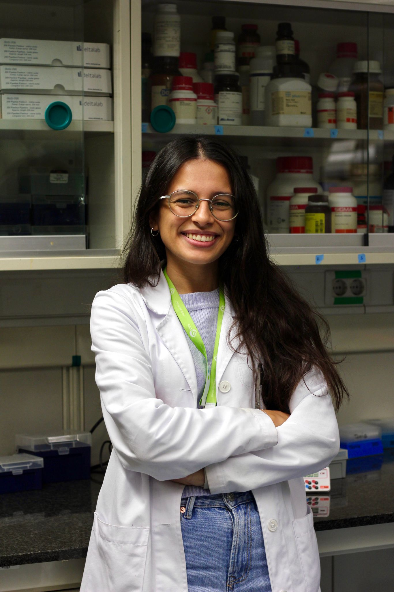

<head>
<meta name="viewport" content="width=device-width, initial-scale=1">

</head>
<body>

<h2>Current Lab Members</h2>
 

  

    

      
      

        <h2>Alfons Navarro</h2>
        
Associate Professor - PI

        
Human Anatomy and Embriology Unit

        
anavarroponz@ub.edu

        

    

  

  

    

      
      

        <h2>Mariano Monzo</h2>
        
Emeritus Professor

        
Human Anatomy and Embriology Unit

        
mmonzo@ub.edu

        

    

  

  
  

    

      
      

        <h2>Melissa Acosta</h2>
        
Designer

        
Human Anatomy and Embriology Unit

        
macostapl@ub.edu

        

    

  

<h2>Clinical col·laborators</h2>

- [Ramón M. Marrades](https://www.clinicbarcelona.org/profesionales/ramon-marrades) (Pulmonologist, Hospital Clínic)
- [Laureano Molins](https://www.barnaclinic.com/es/cuadro-medico/188/laureano) (Thoracic Surgeon, Hospital Clínic)
- [Nuria Viñolas](https://www.clinicbarcelona.org/profesionales/nuria-vinolas) (Oncologist, Hospital Clínic)
- [David Sánchez Lorente](https://www.linkedin.com/in/david-sanchez-lorente-md-phd-10981834/?trk=public_profile_browsemap&originalSubdomain=es) (Thoracic Surgeon, Hospital Clínic)
- [Jorge Moisés Lafuente](https://www.linkedin.com/in/jorge-moisés-lafuente-2563a315/?originalSubdomain=es) (Pulmonologist, Hospital Clínic)
- [José Ramírez Ruz](http://cdb.hospitalclinic.org/facultativos/54/jose-ramirez-ruz) (Pathology, Hospital Clínic)
- [Daniel Martínez](https://www.linkedin.com/in/daniel-martinez-hernandez-b7b22653/?originalSubdomain=es) (Pathology, Hospital Clínic)

<h2> PhD Alumni</h2>

- Bing Han. Thesis: *Characterization of the non-coding RNA cargo in extracellular vesicles from surgical non-small cell lung cancer patients identifies lncRNA HOTTIP and miR-203a-3p as relapse biomarkers* (2023)
- Jordi Canals Serrat.Thesis: *El mesénquima embrionari pulmonar i la seva relació en el control del cáncer de pulmó* (2022)
- Yan Li. Thesis: *Analysis of the K-RAS mutant alleles and lincRNA-p21 expression in tumors and liquid biopsy as prognostic factors in surgical colorectal cancer patients* (2020)
- Jorge Moisés Lafuente. Thesis: *Estudio de los elementos reguladores de la embriogenesis NKX2-1, NANCI y HOTTIP en
estadios precoces de cáncer de pulmón de célula no pequeña* (2020)
- Joan Josep Castellano Pérez. Thesis: *Impacto pronóstico del lincRNA-p21 en tejido tumoral y exosomas de cáncer de pulmón
de célula no pequeña* (2019)
- Sandra Santasusagna Canal. *Exosomas y microRNAs en biopsia líquida como biomarcadors pronóstico del cáncer de
colon* (2018)
- Marc Ruíz Martínez. Thesis: *Estudio del gen YKT6 y miRNAs asociados en la liberación de exosomas en pacientes quirúrgicos de cáncer de pulmón* (2016)
- Anna Cordeiro Santanach. Thesis: *ARNs no codificantes pequeños en Linfoma de Hodgkin: regulación epigenética de microRNAs e importancia de la vía PIWI/Pirna* (2016)
- Rut Tejero Villalba. Thesis: *Utilidad de la familia miR-200 como marcador pronóstico en dos tumores de origen endodérmico: Cáncer de Pulmón y Cáncer Colorrectal* (2014)
- Marina Díaz Beyá. Thesis: *Estudio del patrón de expresión de microRNAs en subtipos de leucemia aguda mieloblástica (LAM) poco frecuentes y análisis del valor pronóstico de microRNAs en LAM de riesgo citogenético intermedio* (2014)
- Marc Campayo Guillaumes. Thesis: *Anàlisi de polimorfismes d’una sola base (SNPs) com a factors predictius de recaiguda en pacients amb càncer de pulmó de cèl·lula no petita quirúrgic* (2011)
- Tania Díaz Sánchez. *JAK2 en el linfoma de Hodgkin: Impacto pronóstico de la regulación mediada por miR-135a y análisis in vitro de Lestaurt* (2011)
- Elena Gallardo Martín. Thesis: *Importancia clínica de los micrornas de la vía de p53 en cáncer de pulmón no microcítico: miR-34a y miR-16* (2011)
- Aina Pons Rosell. Thesis: *Análisis de los perfiles de expresión de microRNAs en enfermedades hematológicas: Síndromes mielodisplásicos y Linfoma de Hodgkin* (2010)

 

</body>
</html>
